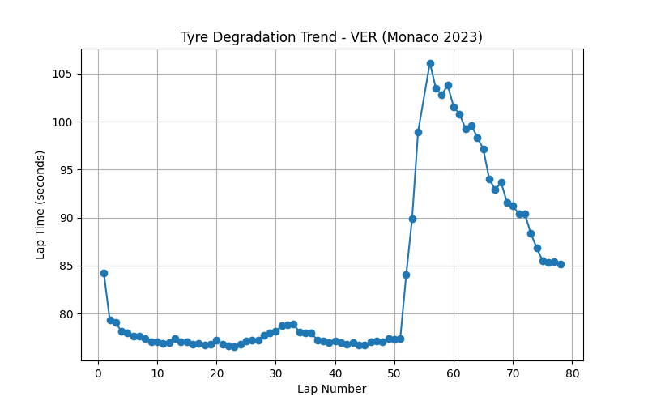
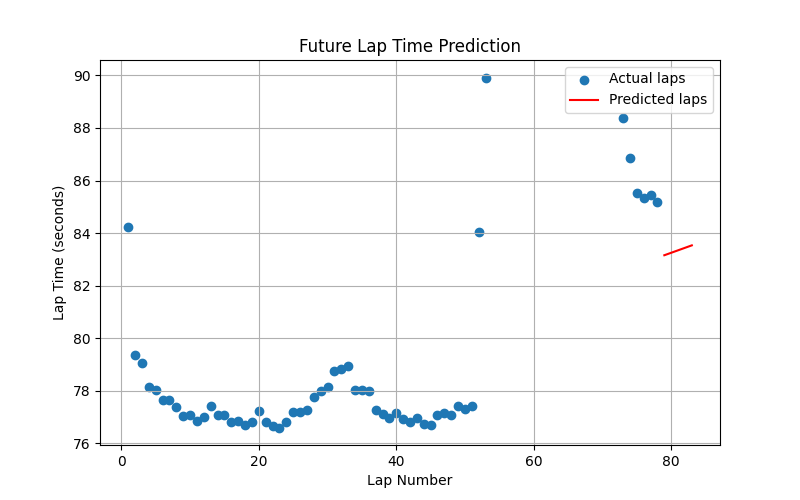
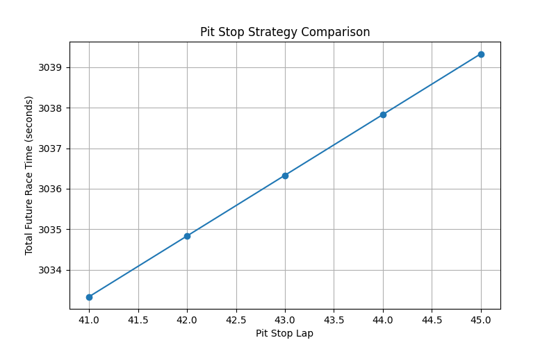

# F1 Race Strategy Simulator 

An AI-assisted Formula 1 race strategy simulator built using **real race telemetry data** from the FastF1 API.
The project analyzes driver lap data, models tyre degradation, predicts future lap times, and simulates pit stop strategies to recommend the optimal race strategy.

---

## Project Overview

Formula 1 teams rely heavily on data and simulations to make race strategy decisions.
This project demonstrates a simplified version of how strategy engineers analyze telemetry data and simulate possible race outcomes.

The system performs the following tasks:

* Load real race data using **FastF1**
* Extract driver lap telemetry
* Analyze lap time trends
* Model tyre degradation
* Predict future lap times using **machine learning**
* Simulate pit stop strategies
* Recommend the fastest strategy

---

## Project Pipeline

```
FastF1 Race Data
        ↓
Lap Time Processing
        ↓
Tyre Degradation Modeling
        ↓
Future Lap Time Prediction
        ↓
Strategy Simulation
        ↓
Optimal Pit Stop Recommendation
```

---

## Project Structure

```
F1_RACE_STRATEGY_SIMULATOR
│
├── analysis
│   ├── test_fastf1.py
│   ├── lap_time_predictor.py
│   └── strategy_optimizer.py
│
├── models
│   ├── plot_utils.py
│   ├── stint_simulator.py
│   ├── strategy_comparator.py
│   └── strategy_simulator.py
│
├── data
│   └── cache
│
├── images
│   ├── lap_time_analysis.png
│   ├── lap_time_prediction.png
│   └── strategy_comparison.png
│
├── README.md
├── requirements.txt
└── .gitignore
```

---

## Visualizations

### Tyre Degradation Analysis

This graph shows the relationship between lap number and lap time, which helps identify tyre degradation patterns during a race stint.



---

### Future Lap Time Prediction

Using a simple machine learning model (Linear Regression), the system predicts future lap times based on past race data.



---

### Pit Stop Strategy Comparison

The simulator evaluates different pit stop laps and calculates the total predicted race time for each option.

The best strategy is selected based on the lowest predicted race time.



---

## Example Output

```
Testing pit stop strategies...

Pit on lap 41 → Total future time: 3033.33 sec
Pit on lap 42 → Total future time: 3034.83 sec
Pit on lap 43 → Total future time: 3036.33 sec

Recommended Strategy:
Pit on lap 41
Expected future race time: 3033.33 sec
```

---

## Technologies Used

* Python
* FastF1
* Pandas
* NumPy
* Scikit-Learn
* Matplotlib

---

## How to Run

Clone the repository:

```
git clone https://github.com/Optimus-cloud/f1-race-strategy-simulator.git
```

Install dependencies:

```
pip install -r requirements.txt
```

Run analysis scripts:

```
python analysis/test_fastf1.py
python analysis/lap_time_predictor.py
python analysis/strategy_optimizer.py
```

---

## Future Improvements

Possible improvements for the simulator:

* Tyre compound modelling (Soft / Medium / Hard)
* Pit stop time loss modelling
* Tyre age degradation curves
* Traffic modelling
* Safety car simulation
* Reinforcement learning strategy AI

---

## Author

Varshini

